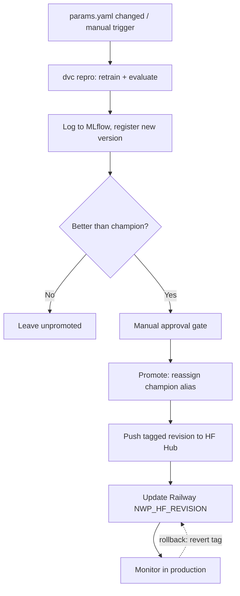
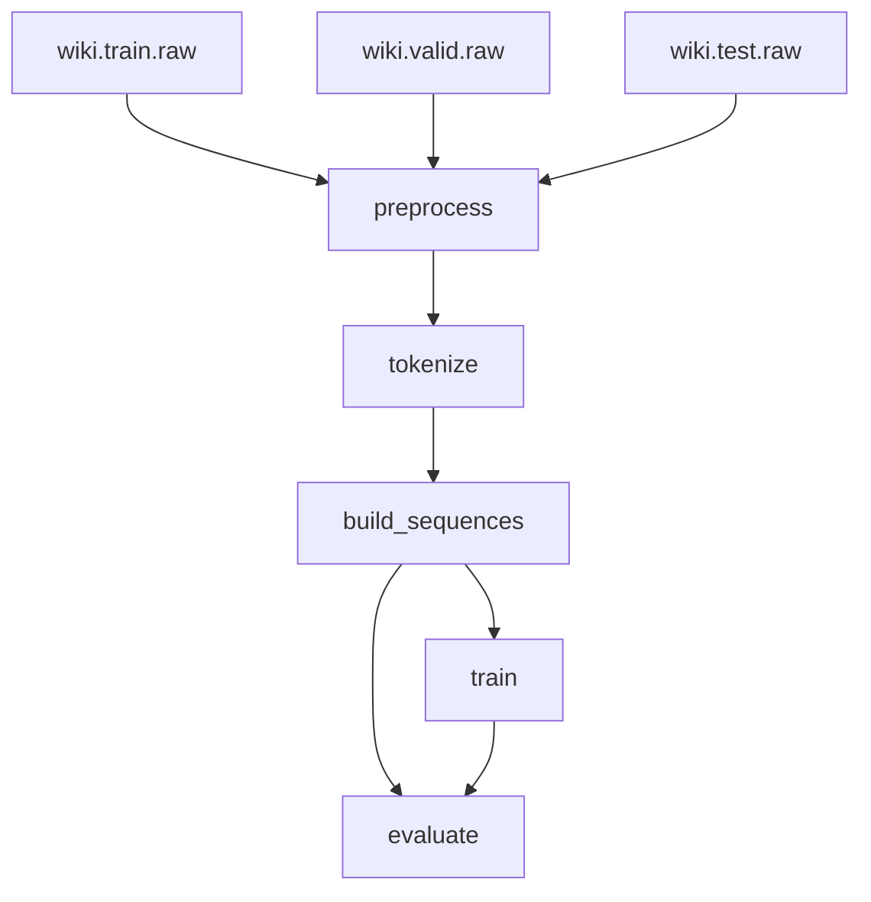

# Next Word Predictor

A next-word prediction language model trained on WikiText-2, served via FastAPI and a React frontend, with a full CI/CD and MLOps pipeline behind it.

**Live app:** [next-word-predictor-iota.vercel.app](https://next-word-predictor-iota.vercel.app)

## Architecture

- **Model**: 2-layer tied-weight LSTM (weight tying between the embedding and output layers), trained on WikiText-2. Current champion: test perplexity ≈ 124.24, top-1 accuracy ≈ 24.6%, top-5 accuracy ≈ 45.2%.
- **Data pipeline**: DVC-managed, five stages — `preprocess` → `tokenize` → `build_sequences` → `train` → `evaluate` (see `dvc.yaml` / `params.yaml`). Data and model artifacts are versioned on a [DagsHub](https://dagshub.com/Ahmad450-gcu/Next-Word-Predictor) DVC remote.
- **Experiment tracking & model registry**: [MLflow](https://dagshub.com/Ahmad450-gcu/Next-Word-Predictor.mlflow), hosted on DagsHub. Every `evaluate` run logs params, test metrics, and the model artifact, and registers a new version of `next-word-predictor`. The version currently serving production traffic carries the `champion` alias.
- **Backend**: FastAPI (`backend/`) — serves `/predict` and `/health`. Downloads the `champion` model + tokenizer from [Hugging Face Hub](https://huggingface.co/dev-Ahmad450/next-word-predictor) at startup. Deployed on Railway.
- **Frontend**: React + Vite (`frontend/`). Deployed on Vercel.

## Project structure

```
src/                core ML code (preprocessing, model definition) — shared by the pipeline and the backend
backend/            FastAPI app
frontend/           React + Vite app
scripts/            one-off utilities: model conversion, HF Hub sync, MLflow compare/promote
data/, models/      DVC-tracked (not in git directly — see .dvc files and dvc.yaml)
params.yaml         all pipeline hyperparameters
dvc.yaml            pipeline stage definitions
.github/workflows/  CI/CD (see below)
```

## Running locally

**Backend:**
```bash
cd backend
pip install -r requirements.txt
uvicorn app.main:app --reload
```

**Frontend:**
```bash
cd frontend
npm install
npm run dev
```

**ML pipeline:**
```bash
pip install -r requirements.txt
dvc pull    # requires DagsHub credentials — see below
dvc repro
```

To point the pipeline at your own DagsHub remote/MLflow server, set:
```bash
export MLFLOW_TRACKING_URI=https://dagshub.com/<user>/<repo>.mlflow
export MLFLOW_TRACKING_USERNAME=<dagshub-username>
export MLFLOW_TRACKING_PASSWORD=<dagshub-token>
```

## CI/CD

Three GitHub Actions workflows, all gating merges to `main` (branch protection requires both app CI checks to pass, with no admin bypass):

| Workflow | Trigger | What it does |
|---|---|---|
| `backend-ci.yml` | push/PR touching `backend/`, `src/` | Fetches the champion model + tokenizer from HF Hub, runs `pytest` |
| `frontend-ci.yml` | push/PR touching `frontend/` | `npm ci`, lint, production build |
| `retrain.yml` | push touching `params.yaml`, or manual dispatch | Full retrain → evaluate → compare-to-champion → **manual approval gate** → promote → sync to HF Hub → redeploy Railway |

### Retrain/promote pipeline in detail



1. `dvc repro` reproduces the pipeline (retrains if `params.yaml` changed) and pushes updated artifacts back to DagsHub.
2. `scripts/compare_model.py` compares the new MLflow model version against whichever version currently holds the `champion` alias: promotion requires lower perplexity **and** no regression in top-1/top-5 accuracy.
3. If better, the workflow pauses in a GitHub **Environment** (`production`) requiring manual reviewer approval before continuing.
4. On approval, `scripts/promote_model.py` reassigns the `champion` alias, pushes the model + tokenizer to HF Hub as a new tagged revision, and the workflow updates Railway's `NWP_HF_REVISION` variable via the Railway CLI, triggering a redeploy.
5. Rollback is a single env var change: point `NWP_HF_REVISION` back at a previous tag.

### Known limitations

GitHub-hosted runners hard-cap job execution at 6 hours. A full multi-epoch retrain on CPU can exceed this, and the training hardware available during development was CPU-only. The `retrain` job is fully implemented and correct, and the `compare`/`promote` stages are tested against a real registered model — but a full-scale retrain has not been executed end-to-end. Production use of the retrain trigger would need a self-hosted GPU runner.

## Reproducing the pipeline

```bash
dvc repro
```

### Pipeline DAG



`evaluate` depends on both `train`'s output (the model) and `build_sequences`'s output (the test split) directly — matches `dvc dag`.

See `dvc.yaml` for the full stage graph, and the READMEs inside `backend/` and `frontend/` for service-specific details.
